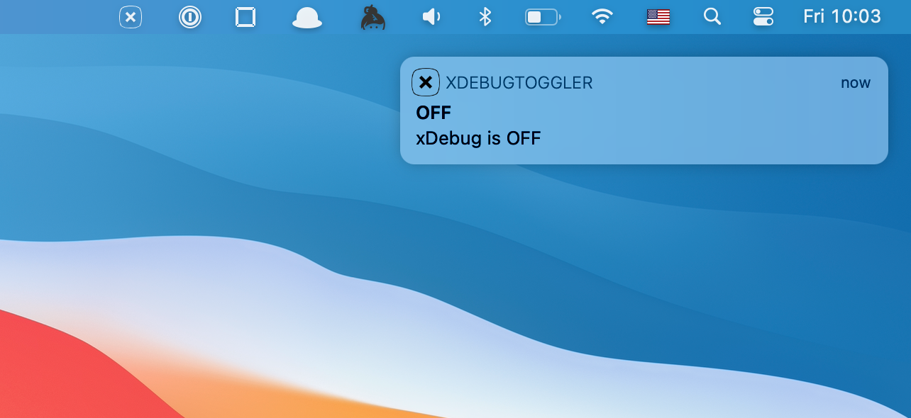
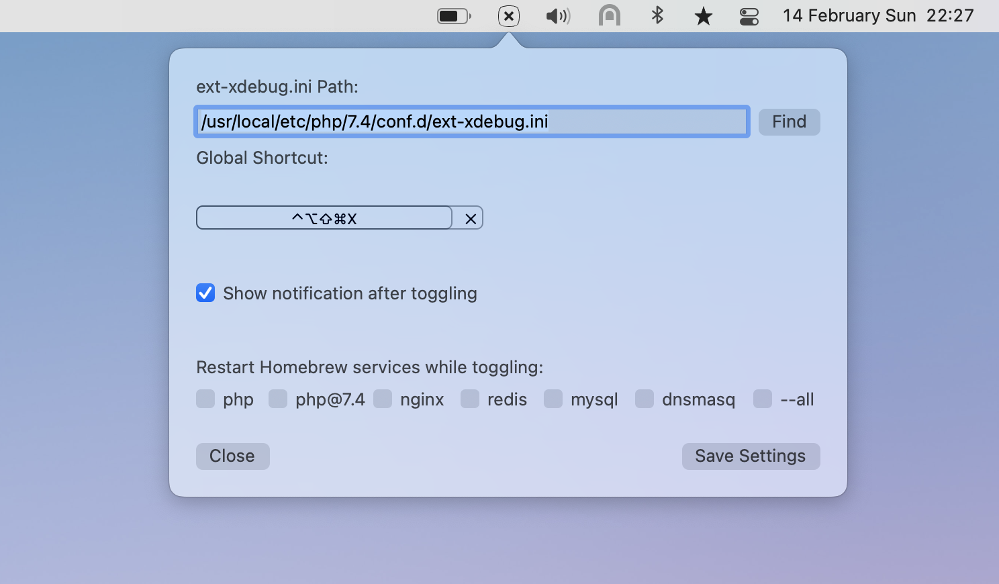
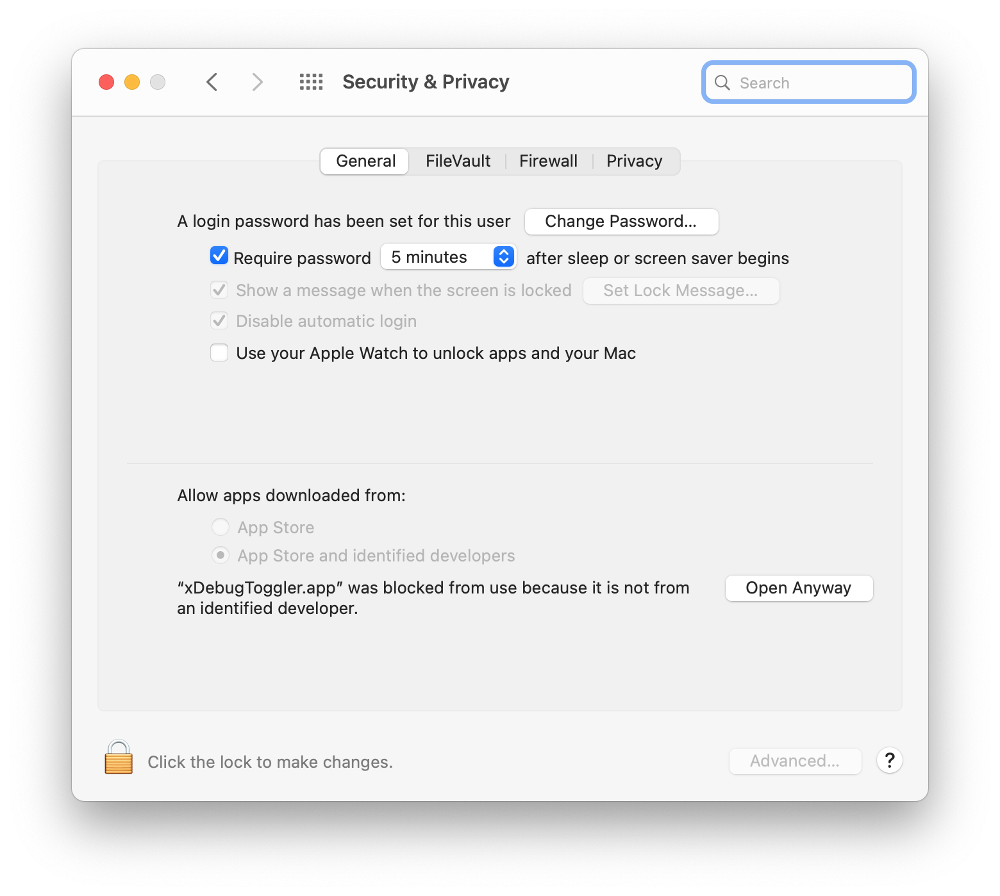
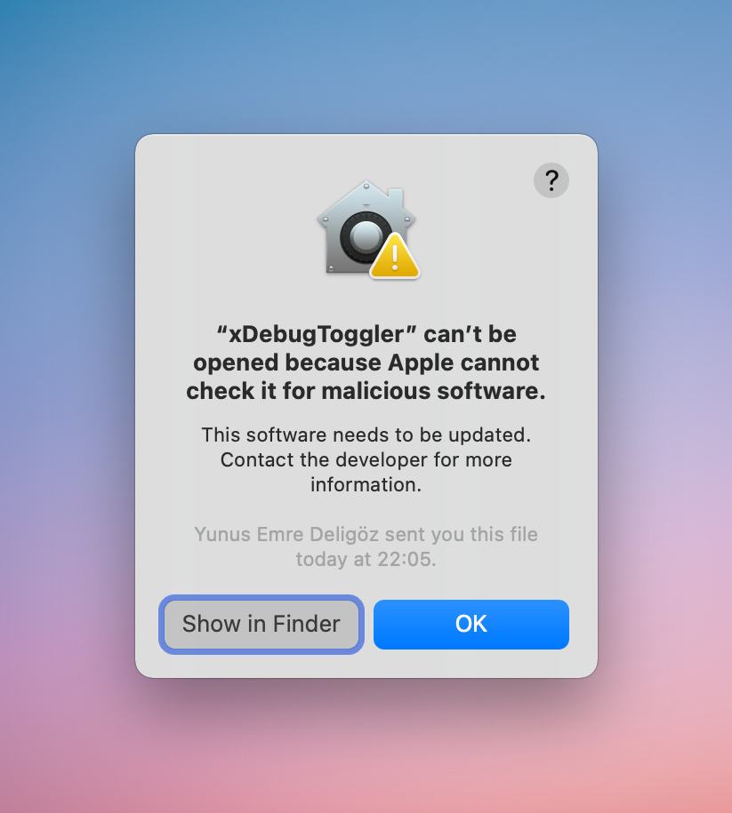
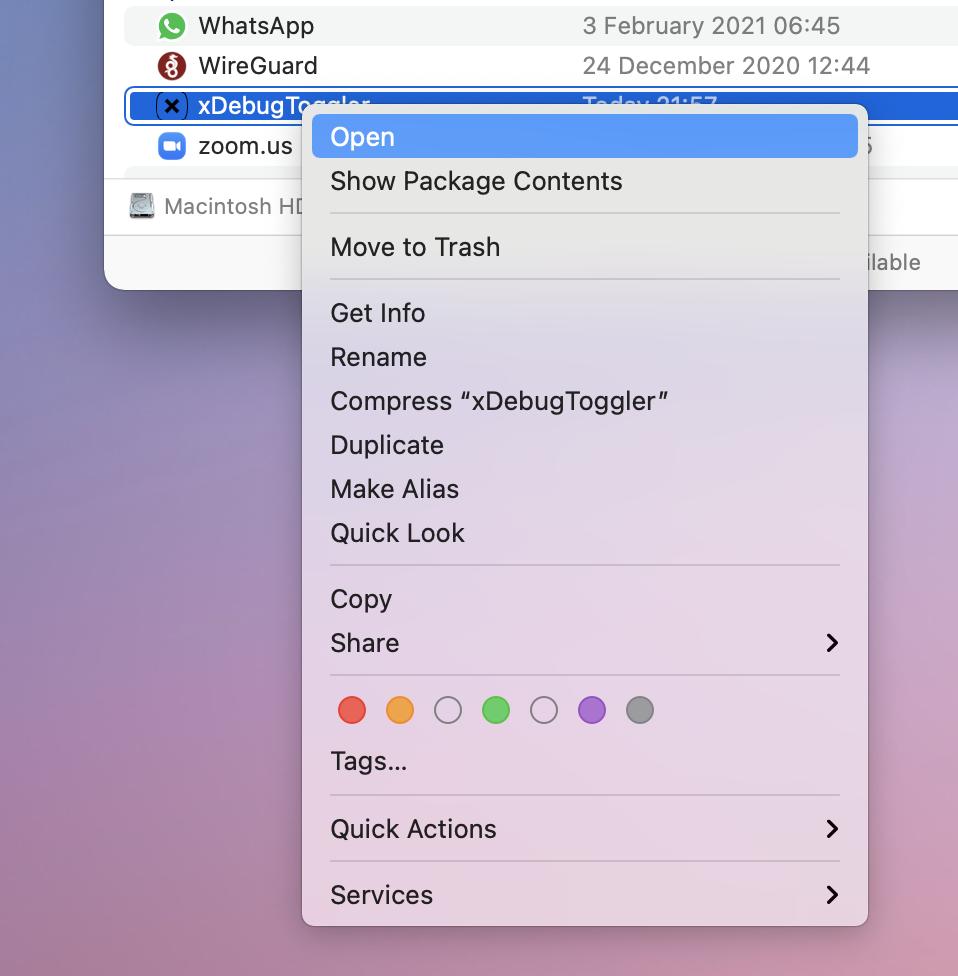
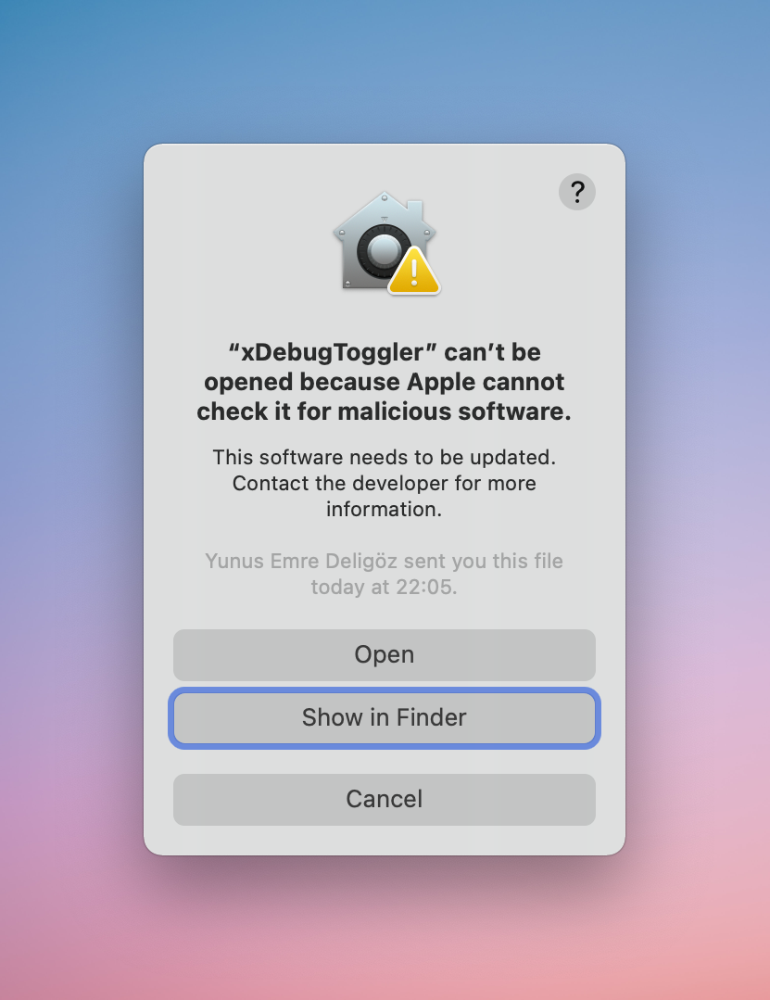

<div align="center">

[](https://github.com/deligoez/xDebug-Toggler)

### xDebug-Toggler



</div>

[Xdebug](https://xdebug.org) is a must-have extension for PHP, although sometimes you need to toggle it to make things faster.

xDebugToggler.app for macOS allows you simply toggle xDebug `on` and `off`.

You can also restart the system some services while toggling like `PHP`, `Nginx`, `MySQL` that you can choose on the application settings.

If you just work on `CLI` scripts like `testing`, you shouldn't need to restart any system service.

## 🚀 Installation

- Using [Homebrew Cask](https://caskroom.github.io/):
  - ```shell
    brew tap deligoez/cask
    brew cask install xdebug-toggler
    ```

- Manual:
  - Download the [latest dmg](https://github.com/deligoez/xDebug-Toggler/releases/latest), open, and drag the app to the Applications folder.

## 🙌 Usage

You should have an `ext-xdebug.ini` file on your local `PHP` config path like `/usr/local/etc/php/7.4/conf.d/ext-xdebug.ini`

If you defined your xDebug extension directly on the `php.ini` file, you should remove this line and add an `ext-debug.ini` file on the `conf.d` folder.

An example `ext-xdebug.ini` file can look like that:

```ini
[xdebug]
zend_extension="/usr/local/opt/php/pecl/20190902/xdebug.so"
```

You can also set extra options for your choosen IDE like so:

```ini
[xdebug]
zend_extension="/usr/local/opt/php/pecl/20190902/xdebug.so"
xdebug.remote_autostart=1
xdebug.default_enable=1
xdebug.remote_port=9000
xdebug.remote_host=127.0.0.1
xdebug.remote_connect_back=1
xdebug.remote_enable=1
xdebug.idekey=PHPSTORM
xdebug.file_link_format=phpstorm://open?%f:%l
```

## ⚙️ Settings

Right-click the app's icon on the status bar and choose `Settings...`

<div align="center">



</div>

## ❓How it works

xDebugToggler simply renames the `ext-xdebug.ini` file to `ext-xdebug.ini.disabled`

While restarting services xDebugToggler app uses `brew restart service` command in the background.

## 🕵🏻‍♂️ Troubleshooting

After the first start, you may need to allow the app to open from `Security & Privacy` preferences.

<div align="center">



If you see a warning that the app can't be opened because Apple cannot check it for malicious software. You can do the following:



- Locate the app on your `/Applications` folder and right click on it.



- Click the `Open` while pressing the `Option/Alt` Key on the keyboard.



- After that, you will be able to see and click the `Open` button.


</div>

## 📄 Requirements

macOS 10.14+

## 📖 Changelog

Please see [CHANGELOG.md](CHANGELOG.md) for more information on what has changed recently.

## 🤝 Contributing

Please see [CONTRIBUTING.md](CONTRIBUTING.md) for details.

## 🔒  Security and Vulnerability Reporting

For full information and description of our security policy please visit [SECURITY.md](SECURITY.md)

## 🎉 Credits

- [Yunus Emre Deligöz](https://github.com/deligoez)
- [All Contributors](../../contributors)

## 📄 License

The MIT License (MIT). Please see [LICENSE.md](LICENSE.md) for more information.
